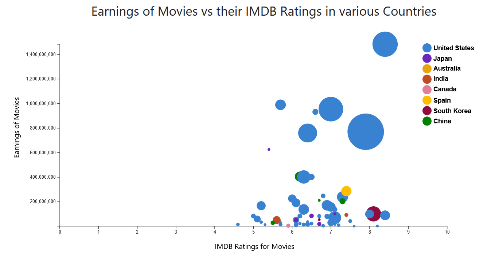

# Earnings of Box Office Movies vs their IMDB Ratings

## Overview
The starter code for this assignment shows a single panel on the index.html page. You should plot a bubble chart with the following instructions.

## Data and Chart Description

This project uses one csv file in the `data/` folder: `Box_Office_Movies.csv`. In the year 2022, the above csv file contains top rated movies on the Box Office. It contains details such as ratings, number of reviews, title and director of the movies. 

## Assignment Steps

### Step 0: 
In the HTML file's `head` section, add your name and email.

### Step 1:
In the HTML file, there is a div with the id `my_dataviz`. Create an `svg` element inside this div.

### Step 2:
Since D3 doesn't have any information about the attribute types of the new files, it interprets every data value as a string.

### Step 3:
Next, create the x- and y-axes for your chart. The x-axis will show the ratings, so we will use a `d3.scaleLinear` for it. The y-axis will show total earnings per movie, so we will use `d3.scaleLinear` again. The more number of ratings a movie has, the larger its bubble radius will be. The y-axis range will be from minimum earnings to maximum earnings and the x-axis range will be from 0 to 10, since IMDB ratings have a distribution from 0 to 10.

### Step 4:
We want to visualize the movies that has performed well at the box office in 2022 in coordination with their IMDB ratings. To achieve this, we will create a [bubble chart](https://datavizproject.com/data-type/bubble-chart/). A bubble chart displays three variables of data, and can only be plotted with numerical data. To plot the data points, you have to specify the radius of the bubbles inside the chart using the total number of reviews given for that particular movie.

### Step 5:
It’s crucial for the audience to understand what the visualization represents. To do this, add a legend at the upper right corner of the chart, as shown in the first screenshot of the completed assignment. The legend should have a circle for each country showing the colors, with labels reading the respective country names. Then add titles for your x-axis and y-axis: "IMDB Rating for the Movie" for the x-axis and a rotated "Earnings of the Movie" for the y-axis.

### Step 6:
As a final step, add some interaction to the chart. When you hover over any data point in the chart, that data point should get highlighted with a border color of black and some stroke width.

Once you are finished with Step 6 and you have your chart looking similar to the screenshot above, you are done! Be sure to commit and push your completed code by the deadline.

---
