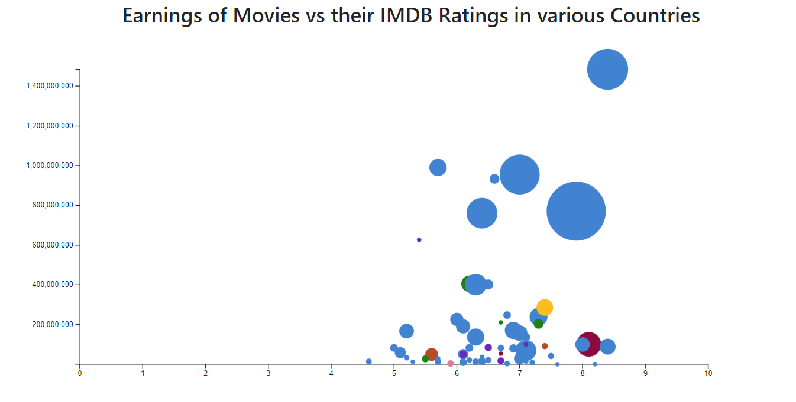

# Extra Credit Homework: Earnings of Box Office Movies vs their IMDB Ratings

The purpose of this homework is for you to draw a bubble chart that shows the earnings of top box office movies and their IMDB ratings along with total number of reviews for a movie.

By the end of this homework, you will learn the following:

* Loading a dataset
* Performing DOM selection
* Filtering data attributes
* Creating axes
* Adding a legend
* Using the D3 domain, range, and scale functions
* Adding axes labels
* Creating circles in svg
* PLot values in a bubble chart

The screenshot below shows an example of what your finished interface will look like.

## Overview
The starter code for this assignment shows a single panel on the index.html page. You should plot a bubble chart with the following instructions.

## Data and Chart Description

This assignment uses one csv file in the `data/` folder: `Box_Office_Movies.csv`. In the year 2022, the above csv file contains top rated movies on the Box Office. It contains details such as ratings, number of reviews, title and director of the movies. 

## To start the assignment

* Clone this code to your local machine.
* Using a local server (such as HTTP Simple Server), open the **index.html** file. Remember, homeworks will be graded using Firefox and Python's HTTP Simple Server.
* Modify the source code according to the instructions below.

## Assignment Steps

### Step 0: 
In the HTML file's `head` section, add your name and email.

### Step 1:
In the HTML file, there is a div with the id `my_dataviz`. Create an `svg` element inside this div. The `svg` should have a width of 1100 px and a height of 550 px.

> 🔍 **Note:** You can add the `svg` directly in the HTML or via Javascript in the `js/main.js` file.

### Step 2:
In `main.js`, the Box Office Movies csv file is loaded.

Since D3 doesn't have any information about the attribute types of the new files, it interprets every data value as a string. To use the quantatitive columns as such, you'll need to do some data wrangling to convert each row of the data to the correct numeric format. For the required columns, change the attribute type from string to numeric. D3's data loading functions (e.g. d3.csv) have a provision for that, which is documented [here](https://github.com/d3/d3-fetch/blob/master/README.md). You can also do the converting after you have loaded the data.

### Step 3:
Next, create the x- and y-axes for your chart. The x-axis will show the ratings, so we will use a `d3.scaleLinear` for it. The y-axis will show total earnings per movie, so we will use `d3.scaleLinear` again. The more number of ratings a movie has, the larger its bubble radius will be. The y-axis range will be from minimum earnings to maximum earnings (i.e you need to find the minimum and maximum values of the Earnings of all the movies), and the x-axis range will be from 0 to 10, since IMDB ratings have a distribution from 0 to 10.

> 🔍 **Hint:** You'll need to use D3 `range` and `domain` to do this.

### Step 4:
We want to visualize the movies that has performed well at the box office in 2022 in coordination with their IMDB ratings. To achieve this, we will create a [bubble chart](https://datavizproject.com/data-type/bubble-chart/). A bubble chart displays three variables of data, and can only be plotted with numerical data. To plot the data points, you have to specify the radius of the bubbles inside the chart using the total number of reviews given for that particular movie.

You have to pick a different color for each country. You can choose the colors of your choice, however they should not be looking too similar. Consider using d3-scale-chromatic. Refer to below screenshot.

> 🔍 **Hint:** Give some margin around the outside of your chart so your objects don't run off the edge of the `svg`.

### Step 5:
It’s crucial for the audience to understand what the visualization represents. To do this, add a legend at the upper right corner of the chart, as shown in the first screenshot of the completed assignment. The legend should have a circle for each country showing the colors, with labels reading the respective country names. Then add titles for your x-axis and y-axis: "IMDB Rating for the Movie" for the x-axis and a rotated "Earnings of the Movie" for the y-axis.

### Step 6:
As a final step, add some interaction to the chart. When you hover over any data point in the chart, that data point should get highlighted with a border color of black and some stroke width.

Once you are finished with Step 6 and you have your chart looking similar to the screenshot above, you are done! Be sure to commit and push your completed code by the deadline.

### Step 7 (OPTIONAL):
You can add some background to the chart to make it look more attractive. This step is optional.
---

## Grading

This assignment is worth 10 points.
- (1 pt each) Steps 0, 1, 4, and 6
- (2 pts each) Steps 2, 3 and 5
